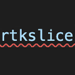

# rtkslice : Snippet for Redux ToolKit's slice (Typescript)

## For use : 
type ```rtkslice``` in typescript file and press enter



### Example of snippet generated: 
```typescript
import { createSlice, PayloadAction } from '@reduxjs/toolkit';

export interface SliceNameState {
  property: type;
}

const initialState: SliceNameState = {
  property: initialValue,
};

export const SliceNameSlice = createSlice({
  name: 'SliceName',
  initialState,
  reducers: {
    reducerName: (state, action: PayloadAction<actionType>) => {
      state.property = action.payload;
    },
  },
});

export const { reducerName } = SliceNameSlice.actions;

export default SliceNameSlice.reducer;
```
